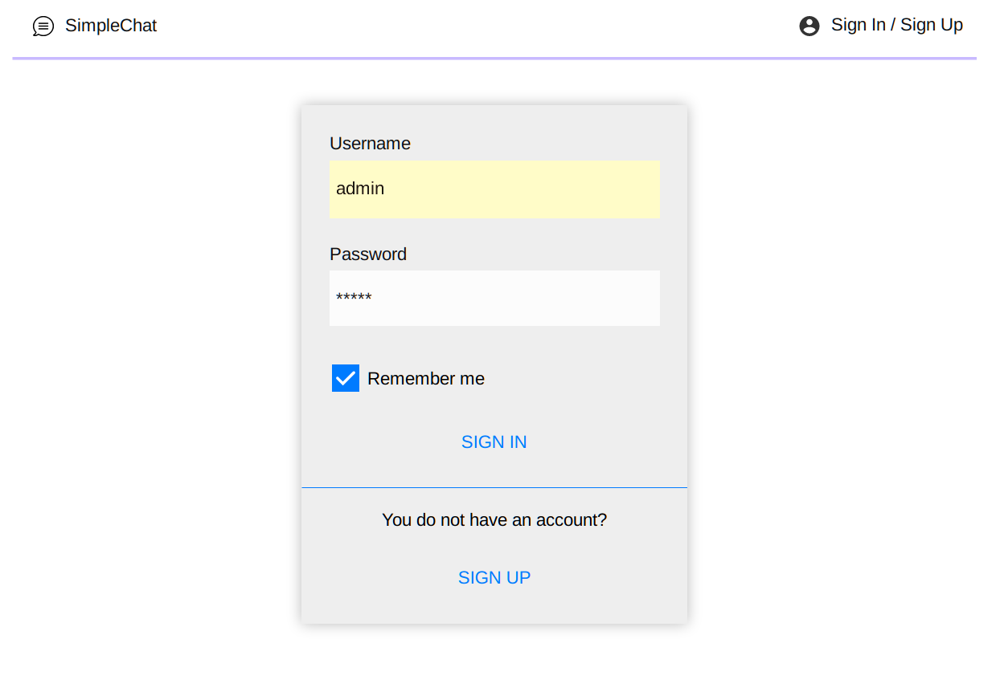
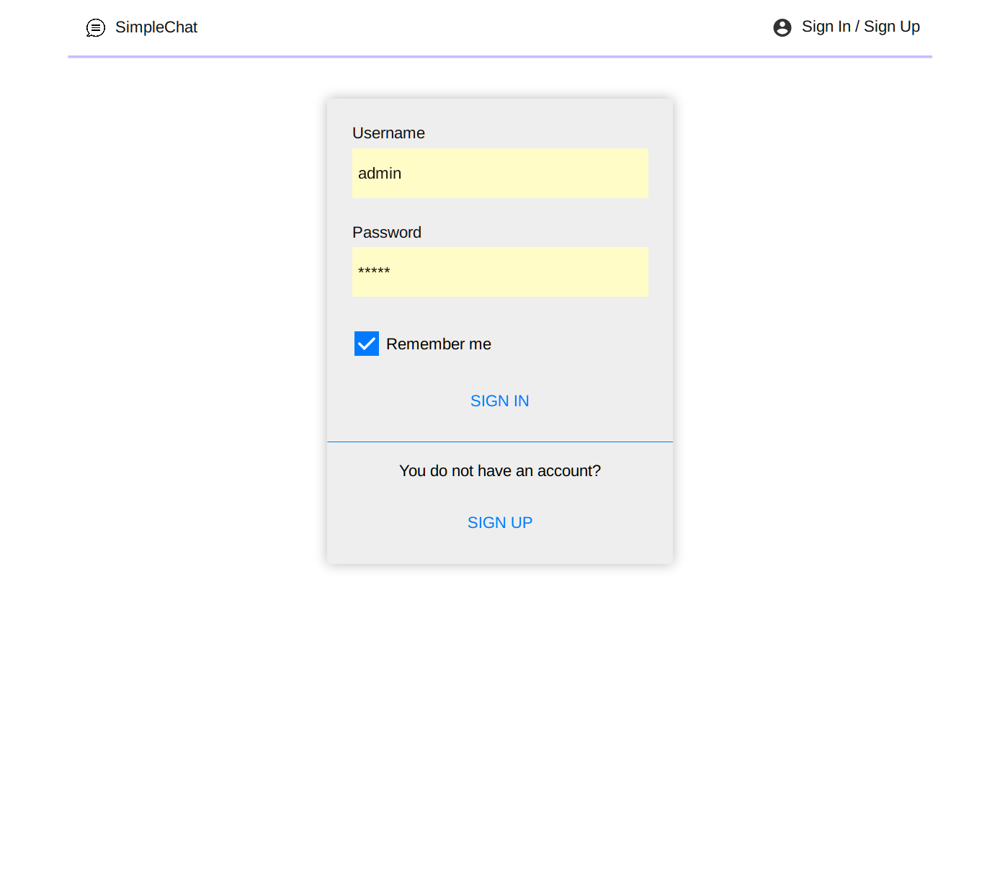
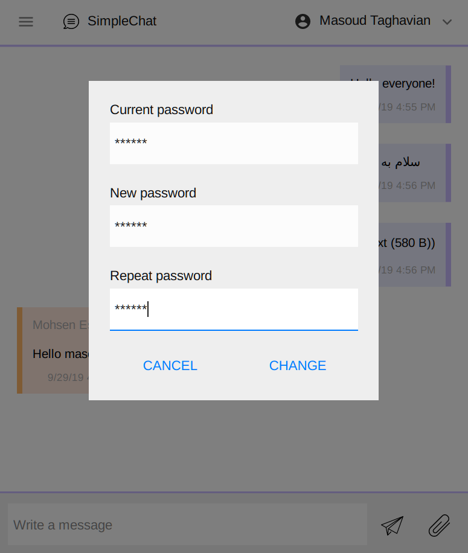
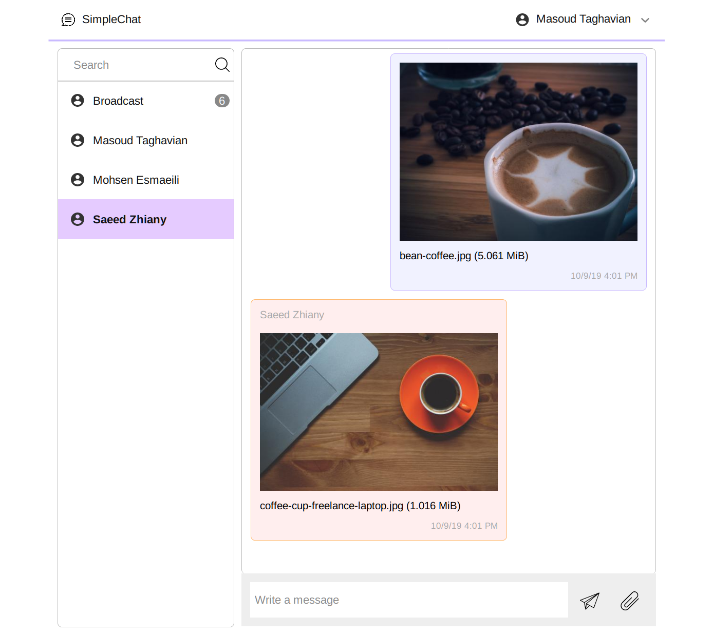

## What is this
  
This is a simple chat application demonstrating Spring Boot capabilities such as:
* Authentication
  * Using session validation (Login)
  * Using cookies (Remember me functionality)
  * Using basic authentication
* Self-signed HTTPS connection
* Web socket
* Download/Upload files
* JPA persistence
* Redirecting to login page for logging in, then redirecting to desired page after that
* Caching files in memory for better performance (Reloads file based on date-modified)
* Clearing expired session after 1-hour idle
* Keeping sessions in memory for better performance
  
This application also demonstrates some user interface capabilities such as:
* Modal
* Toast or notification
* Web socket
* Responsive
* HttpRequest

## How to use
1. Build application with "mvn package"
2. Run application with "java -jar target/simplechat-0.0.1-SNAPSHOT.jar"
3. Use Firefox or Chrome to open http://localhost:62600/ 
4. Sign-up at least two user accounts
5. Start chatting, you can do the following:
	* Send text massages
	* Upload files to create file messages
	* Download files by clicking on file-messages

## About
Masoud Taghavian (masoud.taghavian@gmail.com)  
Enjoy!

## Screenshots

